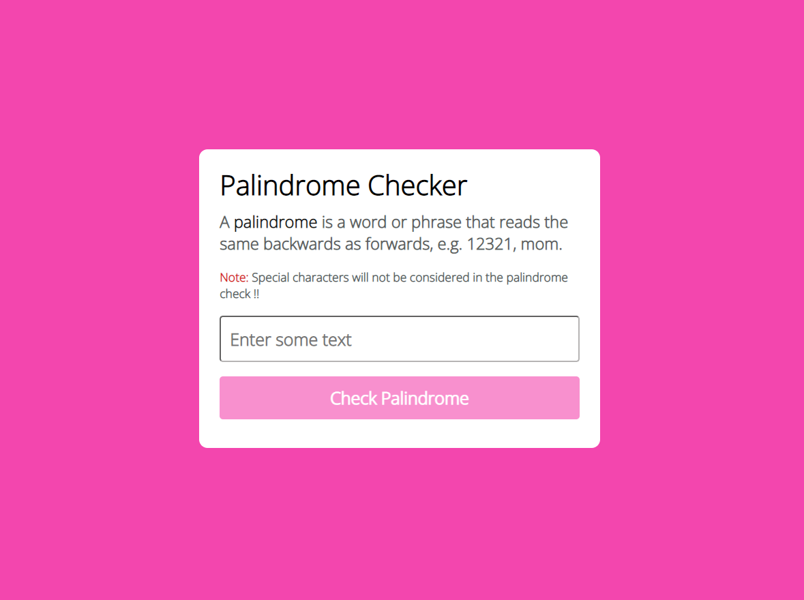

# Palindrome-Checker
Checks whether a word is a palindrome or not. 
A [Palindrome](https://en.wikipedia.org/wiki/Palindrome) is a word that reads the same backward as forward, such as madam or racecar.
 
 

A preview to the Palindrome checker :

[Link to the Palindrome checker](https://avinash905.github.io/Palindrome-Checker/)